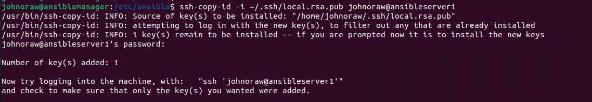

# Build

I will be doing these exercises in VMWare Workstation on a local computer. If you are working in Azure labs, just read and follow along.

I am building this on a Dell laptop from 2017, with VMWare Workstation 17.5.0. These exercises will work in any environment where you can run multiple Linux instances.

I take a gold image of Ubuntu 22.04 Server and make two linked clones, AnsibleServer1 and AnsibleServer2.

I create a linked clone of a Ubuntu 22.04 Desktop called AnsibleManager.

I bridge all three, so they show on my client network (192.168.5.0/24).

| Server         | IP Address    |
| -------------- | ------------- |
| AnsibleServer1 | 192.168.5.111 |
| AnsibleServer2 | 192.168.5.112 |
| AnsibleManager | 192.168.5.110 |

The gateway for this LAN is on 192.168.5.10 and the DNs are at 192.168.6.21 and 22.

On the servers, I did updates and installed the minimum software I need.

```
sudo apt update
sudo apt-upgrade -y
sudo apt install dnsutils -y
sudo apt install iputils-ping -y
sudo apt install nano -y
```

To change the IPv4 address on the servers, edit **/etc/netplan/00-installer-config.yaml** as shown. Note this is for my system, use your own values for IPv4, DNS, etc.

```
network:
  ethernets:
    ens33:
      dhcp4: no
      addresses:
        - 192.168.5.111/24
      routes:
        - to: default
          via: 192.168.5.10
      nameservers:
        addresses:
          - 192.168.6.21
          - 192.168.6.22
  version: 2
```

On AnsibleManager, set the static IPv4 address via the GUI.

<figure><figcaption></figcaption></figure>

Do a ping test from device to device using their IPv4 addresses..

I SSH into both server instances and change **/etc/hostname** to the correct server names.

I also use RDP to console into the AnsibleManager and change its name. Note that I must login locally for RDP to work.

On all three nodes, I edit **/etc/hosts** so they can find each other, this saves us setting up a DNS. This example is from AnsibleManager

<figure><figcaption></figcaption></figure>

Do a ping test from device to device using their names.
