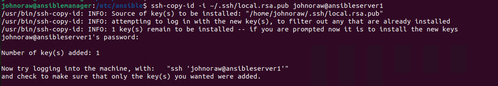

# Security

Keeping things simple, I have carried out all the tasks in this walkthrough using my personal account. This is bad practice. On a production system, I would create a service account called **provisioning** and use this for all tasks associated with Ansible, at both the client and server.

To make it work seamlessly, the provisioning account must be able to **sudo** without a password. I cover how to configure this in my Linux SSH notes.

I am also using RSA keys, it would be better to use EC or ED, more on this in my security and Linux notes.&#x20;

## AnsibleManager

I need to install ssh server.&#x20;

```
sudo apt install openssh-server -y
```

Next I need to generate some local keys for use with Ansible.

```
ssh-keygen -t rsa -b 4096 -f ~/.ssh/local.rsa -C john.oraw@hotmail.com
```

I need to copy the SSH IS from my AnsibleManager to each server.

```
ssh-copy-id -i ~/.ssh/local.rsa.pub johnoraw@ansibleserver1
```

and

```
ssh-copy-id -i ~/.ssh/local.rsa.pub johnoraw@ansibleserver2
```

<figure><figcaption></figcaption></figure>

To test, try to login to both ansibleservers. You will not be asked for a password!

<figure><figcaption></figcaption></figure>

That's simple connectivity tested!
